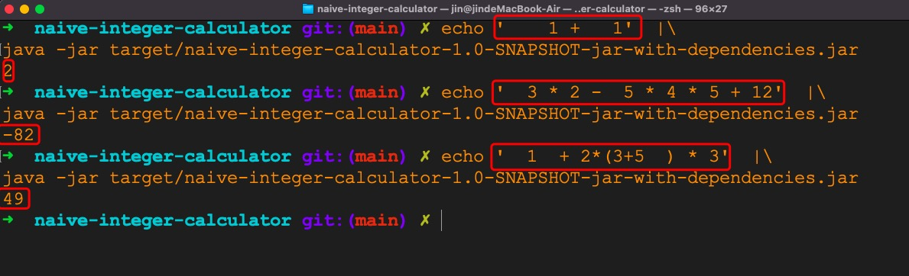

# naive-integer-calculator

A very simple calculator that only support `+-*/` and `()` for integers

## Usage

```bash
mvn clean package
echo '1+1' | java -jar target/naive-integer-calculator-1.0-SNAPSHOT-jar-with-dependencies.jar
```


### Some example
